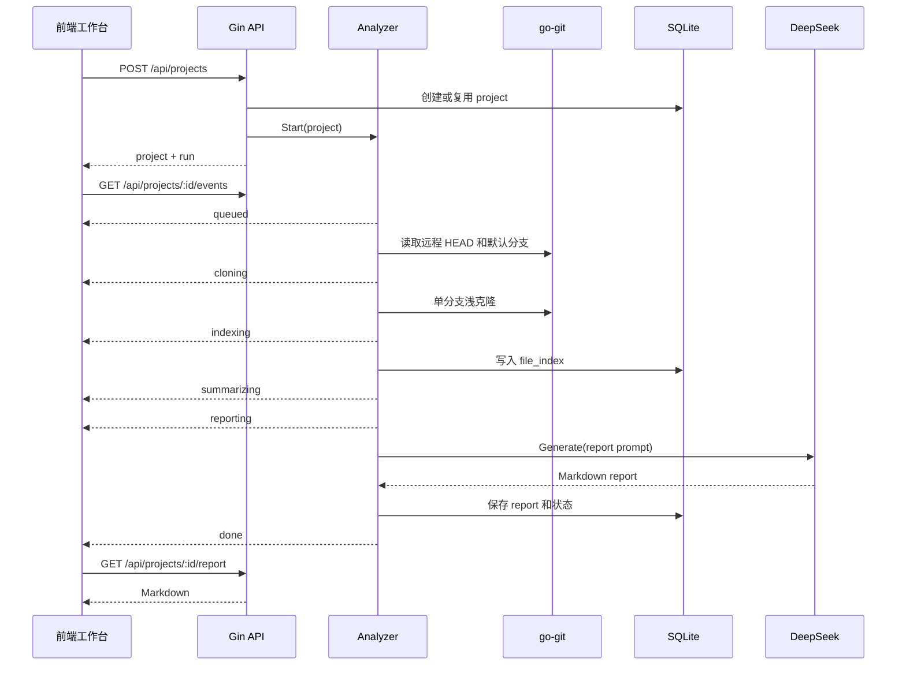
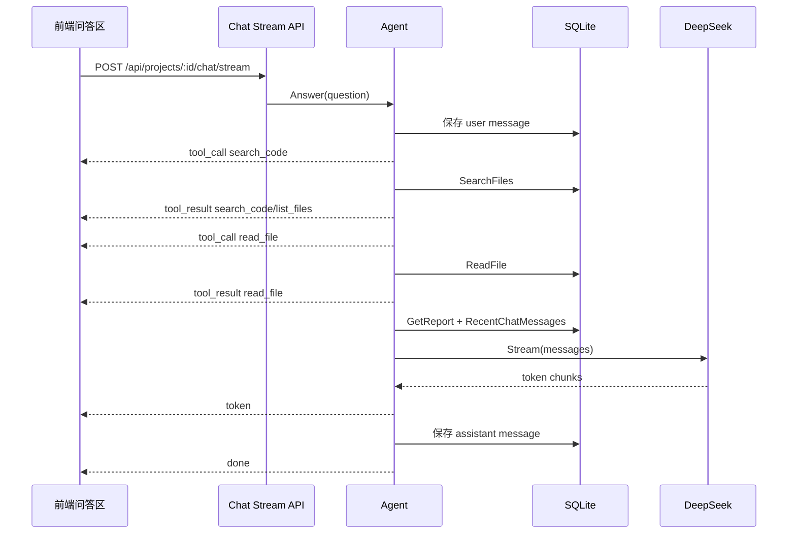

# project-helper 🍊

面向源码初学者的项目学习助手。输入公开 GitHub 仓库地址，自动克隆源码、建立索引，调用 DeepSeek 生成中文 Markdown 阅读地图，并支持基于源码上下文的流式问答。

## 快速开始

### 直接使用

如果你只是想使用 project-helper，不需要自己安装 Go、Node.js 或编译源码，推荐直接下载已打包好的版本：
**[下载 project-helper v1.0.0](https://github.com/orangelab-dev/project-helper/releases/tag/v1.0.0)**

**注意：** 下载源码过程需要连接到 github，如果使用 VPN 的话请打开"虚拟网卡模式"或“TUN 模式”

Release 中提供 macOS 和 Windows 版本。下载后把可执行文件、启动脚本和 `.env` 放在同一个文件夹，编辑 `.env` 填入 `DEEPSEEK_API_KEY`，再运行对应平台的启动脚本即可。

### 从源码运行

#### 环境要求

- Go 1.24+
- Node.js 18+ & npm
- DeepSeek API Key

#### 一键启动

```bash
# 1. 克隆项目
git clone https://github.com/orangelab-dev/project-helper.git
cd project-helper

# 2. 配置 API Key
cp .env-example .env
# 编辑 .env，填入你的 DEEPSEEK_API_KEY
vim .env

# 3. 一键启动
./start.sh
```

启动后打开 **http://localhost:5173** 即可使用。

脚本会自动检查依赖、安装前端包、同时启动前后端服务，按 `Ctrl+C` 停止。

#### 生产单文件构建

如果希望把前端打包进后端，生成一个可直接运行的二进制文件：

```bash
./build.sh
./bin/project-helper
```

构建脚本会先执行 `frontend` 的生产构建，再使用 `go build -tags prod` 把 `frontend/dist` 嵌入后端。启动后打开 **http://localhost:8080** 即可使用，不需要再单独启动 Vite。

生产构建阶段需要 Go、Node.js 和 npm；运行 `bin/project-helper` 时只需要生成好的二进制文件、`.env` 配置和运行时数据目录。

#### 手动启动

如果需要分别启动前后端：

```bash
# 安装前端依赖
cd frontend && npm install && cd ..

# 启动后端（默认 :8080）
go run ./cmd/server

# 启动前端（默认 :5173，另一个终端）
cd frontend && npm run dev
```

### 使用方式

1. 在左侧输入框粘贴公开 GitHub 仓库地址，如 `https://github.com/gin-gonic/gin`
2. 点击「开始分析」，等待进度条走完
3. 报告生成后可在「阅读地图」区浏览，点击目录标题可跳转
4. 在右侧「源码问答」区输入问题，如"请求是怎么流转的？"
5. 支持亮色/暗色主题切换，左侧栏和右侧问答面板均可折叠

---

## 技术架构

- 后端：Go、Gin、database/sql、modernc.org/sqlite、go-git、CloudWeGo Eino schema 适配、DeepSeek Chat Completions API。
- 前端：Vue 3 Composition API、Vite、MarkdownIt、highlight.js、lucide-vue-next。
- 数据：SQLite 数据库保存在 `data/project-helper.db`，仓库克隆缓存在 `data/repos/`，报告文件导出到 `data/reports/`。

## 功能概览

- 输入公开 GitHub 仓库地址，支持 `https://github.com/owner/repo`、`.git` 后缀、`git@github.com:owner/repo.git` 和 `owner/repo` 简写。
- 使用纯 Go 的 `go-git` 获取默认分支、HEAD commit，并按单分支浅克隆仓库。
- 按 commit 缓存克隆目录、文件索引和分析报告，重复分析同一 commit 时复用缓存。
- 扫描源码文件并跳过 `.git`、`node_modules`、`vendor`、`dist`、`build`、`target`、`.next`、`.nuxt`、IDE 目录、覆盖率目录、大文件和常见二进制/资源文件。
- 通过 SSE 实时推送分析状态：`queued`、`cloning`、`indexing`、`summarizing`、`reporting`、`done`、`error`。
- 调用 DeepSeek 生成中文 Markdown 报告，报告目标读者是源码初学者。
- 基于已索引源码和报告片段进行流式问答，前端展示工具调用、工具结果和 token 流。
- 前端支持亮色/暗色主题，并通过 `localStorage` 持久化偏好。

## 目录结构

```text
.
├── cmd/server/                 # 后端入口
├── internal/
│   ├── agent/                  # 源码问答 Agent
│   ├── ai/                     # DeepSeek 客户端与 Eino 消息适配
│   ├── analyzer/               # 分析任务编排、进度事件、报告生成
│   ├── config/                 # .env 读取、默认配置、日志配置
│   ├── db/                     # SQLite 打开与 migration
│   ├── httpapi/                # Gin 路由、API、SSE 输出
│   ├── repo/                   # GitHub URL 解析、go-git 仓库操作、源码索引
│   └── store/                  # SQLite 数据访问层
├── frontend/
│   ├── src/
│   │   ├── App.vue             # 主工作台界面
│   │   ├── composables/        # 主题、Markdown、项目 SSE、问答流
│   │   ├── lib/                # API 与 SSE 解析工具
│   │   └── styles/main.css     # 全局样式和响应式布局
│   ├── package.json
│   └── vite.config.js
├── .env                        # 本地占位配置，不应提交真实密钥
├── .gitignore
├── go.mod
└── go.sum
```

## 运行环境

需要准备：

- Go 1.24 或兼容版本。
- Node.js 和 npm。
- DeepSeek API Key。

项目使用 `modernc.org/sqlite`，SQLite driver 名称固定为 `sqlite`，不依赖 `go-sqlite3`，也不需要 CGO。仓库读取使用纯 Go 的 `go-git`，交叉编译后的 Windows 可执行文件不需要依赖系统 `git.exe`。

## 配置说明

后端启动时调用 `config.Load(".env")`，支持读取 `export KEY=value` 形式的 `.env`。如果环境变量已经存在，`.env` 不会覆盖它。

推荐本地 `.env`：

```bash
export DEEPSEEK_API_KEY=你的_key
export DEEPSEEK_MODEL=deepseek-v4-pro
export DEEPSEEK_BASE_URL=https://api.deepseek.com
export SERVER_PORT=8080
```

可选配置：

```bash
export SERVER_ADDR=:8080
export DATABASE_PATH=data/project-helper.db
export REPOS_DIR=data/repos
export REPORTS_DIR=data/reports
export LOG_PATH=data/logs/server.log
export FRONTEND_URL=http://localhost:5173
```

如果只是想换端口，推荐改 `SERVER_PORT`，例如 `export SERVER_PORT=9090` 后访问 `http://localhost:9090`。`SERVER_ADDR` 适合需要绑定完整地址的场景，例如 `export SERVER_ADDR=127.0.0.1:9090`；如果同时配置，`SERVER_ADDR` 优先。

安全注意：

- `.gitignore` 已忽略 `.env`、`data/`、`frontend/node_modules/`、`frontend/dist/`、`tmp/`、日志文件等内容。
- 不要提交真实 `DEEPSEEK_API_KEY`。
- 如果 `DEEPSEEK_API_KEY` 为空或仍是 `你的_key`，后端会在调用 DeepSeek 时返回“请先在 .env 中配置 DEEPSEEK_API_KEY”。

## 本地启动

安装前端依赖：

```bash
cd frontend
npm install
```

启动后端：

```bash
cd ..
go run ./cmd/server
```

启动前端：

```bash
cd frontend
npm run dev
```

默认地址：

- 后端：`http://localhost:8080`
- 前端：`http://localhost:5173`

Vite 已在 `frontend/vite.config.js` 中配置代理：

- `/api` -> `http://localhost:8080`
- `/healthz` -> `http://localhost:8080`

## 后端架构

### 启动入口

入口文件是 `cmd/server/main.go`。启动流程如下：

1. 读取 `.env` 和环境变量。
2. 初始化日志输出到 stdout 和 `data/logs/server.log`。
3. 打开 SQLite 数据库。
4. 执行 migration。
5. 将上次服务重启导致中断的分析任务标记为失败。
6. 初始化仓库服务、DeepSeek 客户端、分析器和 HTTP 路由。
7. 启动 Gin HTTP 服务。
8. 接收 `SIGINT` 或 `SIGTERM` 后优雅关闭。

### 配置模块

`internal/config/config.go` 定义了：

- `Config`：服务端口、数据库路径、仓库缓存目录、报告目录、日志路径、前端 URL、DeepSeek 配置。
- `DeepSeekConfig`：`APIKey`、`Model`、`BaseURL`。
- `Load`：读取 `.env` 并填充默认值。

`internal/config/logging.go` 将标准日志和 Gin 日志同时写入终端和日志文件。

### 数据库模块

`internal/db/db.go` 负责打开 SQLite 并执行建表语句。连接使用：

- driver：`sqlite`
- foreign keys：开启
- journal mode：WAL
- busy timeout：5000ms
- transaction lock：immediate

数据库表：

| 表名 | 用途 |
| --- | --- |
| `projects` | 项目基本信息、规范化仓库 URL、默认分支、commit、状态 |
| `analysis_runs` | 每次分析任务的状态、阶段、进度、错误 |
| `analysis_reports` | 每个项目 commit 对应的 Markdown 报告、技术栈 JSON、目录树 JSON |
| `file_index` | 已索引源码文件的路径、语言、大小、hash、摘要、内容 |
| `chat_sessions` | 每个项目的问答会话 |
| `chat_messages` | 用户和助手消息历史 |

### Store 层

`internal/store/store.go` 是数据库访问层，封装：

- 项目创建或复用：`UpsertProject`
- 项目列表和详情：`ListProjects`、`GetProject`
- 分析任务创建、更新、完成：`CreateRun`、`UpdateRun`、`FinishRun`
- 服务重启恢复：`RecoverInterruptedRuns`
- 报告读写和缓存判断：`SaveReport`、`GetReport`、`HasReport`
- 文件索引替换、读取、搜索：`ReplaceFileIndex`、`ReadFile`、`SearchFiles`
- 聊天消息保存和历史读取：`SaveChatMessage`、`RecentChatMessages`

项目状态常量定义在 `internal/store/models.go`：

- `queued`
- `running`
- `completed`
- `failed`

### 仓库模块

`internal/repo/repo.go` 负责 GitHub URL 解析、远程 revision 获取、go-git 克隆和源码索引。

URL 解析规则：

- 只允许 GitHub。
- 规范化结果为 `https://github.com/<owner>/<repo>`。
- `owner/repo` 必须匹配 `^[A-Za-z0-9_.-]+/[A-Za-z0-9_.-]+$`。

源码索引规则：

- 最大索引文件大小：`200_000` bytes。
- 二进制判断：读取前 8000 字节，发现 `0` 字节则跳过。
- 跳过目录：`.git`、`node_modules`、`vendor`、`dist`、`build`、`target`、`.next`、`.nuxt`、`.idea`、`.vscode`、`coverage`、`__pycache__`。
- 跳过后缀：`.png`、`.jpg`、`.jpeg`、`.gif`、`.webp`、`.ico`、`.pdf`、`.zip`、`.tar`、`.gz`、`.lock`。
- 语言识别基于扩展名，支持 Go、JavaScript、TypeScript、Vue、Python、Java、Rust、Markdown、JSON、YAML、CSS、HTML 等。
- 每个文件保存 SHA-256 hash、路径、语言、大小、摘要和文本内容。

路径安全由 `SafeRelativePath` 保护，拒绝空路径、根路径和 `../` 越界路径。

### 分析器

`internal/analyzer/analyzer.go` 负责完整分析流程：

1. 创建分析 run。
2. 发布 `queued` 事件，读取远程仓库默认分支和 HEAD commit。
3. 更新项目 revision。
4. 如果当前 commit 已有报告，发布 `done` 并复用缓存。
5. 发布 `cloning`，克隆仓库或复用本地 clone。
6. 发布 `indexing`，扫描目录和源码文件并写入 `file_index`。
7. 发布 `summarizing`，识别技术栈并构建模型上下文。
8. 发布 `reporting`，调用 DeepSeek 生成报告。
9. 保存报告到 SQLite 和 `data/reports/<owner>_<repo>_<sha>.md`。
10. 标记 run 和 project 为完成，并发布 `done`。

如果任意阶段失败，会：

- 将 run 标记为 `failed`。
- 将项目状态标记为 `failed`。
- 发布 `error` 事件。

同一项目同时只允许一个分析任务运行。这个限制由 `Analyzer.running` map 和互斥锁控制。

### AI 客户端

`internal/ai/deepseek.go` 实现 DeepSeek 客户端：

- `Generate`：非流式生成，用于分析报告。
- `Stream`：流式生成，用于源码问答。
- API 路径：`<DEEPSEEK_BASE_URL>/chat/completions`
- 鉴权：`Authorization: Bearer <DEEPSEEK_API_KEY>`
- 支持读取流式 chunk 中的 `content` 和 `reasoning_content`。

代码还提供 `ToEinoMessages`，将内部消息结构转换为 CloudWeGo Eino 的 `schema.Message`。当前业务请求直接调用 DeepSeek HTTP API，Eino 在这里主要用于消息结构适配。

### 问答 Agent

`internal/agent/agent.go` 实现源码问答流程。它不是让模型自由调用工具，而是在后端固定执行一组检索步骤，然后把工具结果作为上下文交给模型：

1. 保存用户问题到聊天历史。
2. 发布 `tool_call: search_code`，在 `file_index` 中按路径和内容搜索问题文本。
3. 如果没有命中，发布 `tool_call: list_files`，读取文件列表作为兜底上下文。
4. 对命中的文件发布 `tool_call: read_file` 并读取内容，单文件超过 6000 字符会截断。
5. 读取已有报告前 5000 字符，发布 `tool_call: get_report_section`。
6. 带上最近 8 条聊天历史，请求 DeepSeek 流式回答。
7. 将 token 逐步发送给前端。
8. 保存助手回答。
9. 发布 `done`。

当前代码中实际会输出的工具事件包括：

- `search_code`
- `list_files`
- `read_file`
- `get_report_section`

`show_tree` 在当前实现中没有独立 API 事件输出，目录树主要用于分析报告生成阶段。

## HTTP API

### 健康检查

```http
GET /healthz
```

响应：

```json
{ "ok": true }
```

### 获取项目列表

```http
GET /api/projects
```

响应：

```json
{
  "projects": [
    {
      "id": 1,
      "repo_url": "https://github.com/gin-gonic/gin",
      "normalized_url": "https://github.com/gin-gonic/gin",
      "owner": "gin-gonic",
      "name": "gin",
      "default_branch": "master",
      "commit_sha": "...",
      "status": "completed",
      "created_at": "...",
      "updated_at": "...",
      "has_report": true,
      "current_run": {
        "id": 1,
        "project_id": 1,
        "status": "completed",
        "step": "done",
        "progress": 100,
        "message": "分析完成",
        "error": "",
        "started_at": "...",
        "finished_at": "..."
      }
    }
  ]
}
```

### 创建或复用项目分析

```http
POST /api/projects
Content-Type: application/json

{
  "repo_url": "https://github.com/gin-gonic/gin"
}
```

可能响应：

- `202 Accepted`：创建分析任务成功。
- `200 OK`：命中缓存或复用已有项目。
- `400 Bad Request`：仓库地址不合法。
- `500 Internal Server Error`：数据库或任务启动失败。

响应示例：

```json
{
  "project": {
    "id": 1,
    "repo_url": "https://github.com/gin-gonic/gin",
    "normalized_url": "https://github.com/gin-gonic/gin",
    "owner": "gin-gonic",
    "name": "gin",
    "status": "queued",
    "has_report": false
  },
  "run": {
    "id": 1,
    "project_id": 1,
    "status": "queued",
    "step": "queued",
    "progress": 0,
    "message": "等待分析"
  }
}
```

### 获取项目详情

```http
GET /api/projects/:id
```

响应：

```json
{
  "project": {
    "id": 1,
    "owner": "gin-gonic",
    "name": "gin",
    "status": "completed",
    "has_report": true,
    "current_run": {}
  }
}
```

### 订阅分析进度

```http
GET /api/projects/:id/events
Accept: text/event-stream
```

服务端会先发送最新 run 快照：

```text
event: snapshot
data: {"id":1,"project_id":1,"status":"running","step":"cloning","progress":18,"message":"正在克隆仓库"}
```

随后推送阶段事件：

```text
event: indexing
data: {"type":"indexing","step":"indexing","progress":38,"message":"正在扫描目录和源码文件"}
```

空闲时每 20 秒发送：

```text
event: ping
data: {"ts":1710000000}
```

完成：

```text
event: done
data: {"type":"done","step":"done","progress":100,"message":"分析完成，报告已导出到 data/reports/...md"}
```

失败：

```text
event: error
data: {"type":"error","step":"reporting","progress":100,"error":"..."}
```

### 获取完整报告

```http
GET /api/projects/:id/report
```

响应：

```json
{
  "markdown": "# 项目概述\n..."
}
```

如果项目尚未完成或报告不存在，会返回 404。

### 源码问答流

```http
POST /api/projects/:id/chat/stream
Content-Type: application/json
Accept: text/event-stream

{
  "question": "这个项目的请求是怎么流转的？"
}
```

事件类型：

```text
event: tool_call
data: {"type":"tool_call","name":"search_code","data":"这个项目的请求是怎么流转的？"}
```

```text
event: tool_result
data: {"type":"tool_result","name":"search_code","data":"[\"cmd/server/main.go\",\"internal/httpapi/router.go\"]"}
```

```text
event: token
data: {"type":"token","data":"这个项目的请求入口在..."}
```

```text
event: done
data: {"type":"done"}
```

```text
event: error
data: {"error":"项目还没有完成分析"}
```

## 前端说明

前端入口是 `frontend/src/main.js`，主界面是 `frontend/src/App.vue`。

页面布局：

- 左侧边栏：品牌、主题切换、仓库输入、历史项目。
- 顶部状态栏：当前项目和分析进度。
- 主内容区：Markdown 报告阅读。
- 右侧问答区：工具调用时间线、流式回答、问题输入、停止生成。

核心 composable：

- `useTheme`：读取系统主题或 `localStorage`，切换后写入 `document.documentElement.dataset.theme`。
- `useProjectStream`：使用浏览器原生 `EventSource` 订阅项目分析 SSE。
- `useChatStream`：使用 `fetch` 和 `AbortController` 发起 POST 流式问答，可停止生成。
- `useMarkdown`：使用 MarkdownIt 渲染报告和回答，关闭 HTML，开启 linkify 和代码高亮。

辅助库：

- `frontend/src/lib/api.js`：封装 REST API。
- `frontend/src/lib/sse.js`：解析手动读取的 SSE block，供问答流使用。

样式特点：

- CSS 变量定义亮色和暗色主题。
- 使用响应式 grid，在窄屏下侧边栏、报告和问答区纵向排列。
- 为输入框、按钮和文本区域提供可见 focus outline。
- 支持 `prefers-reduced-motion: reduce`。

## 核心业务流程

### 项目分析流程



### 问答流程



## 缓存策略

缓存粒度是 `project_id + commit_sha`。

- 仓库 clone 路径：`data/repos/<owner>/<repo>/<commit_sha>`。
- 文件索引表：`file_index(project_id, commit_sha, path)` 唯一。
- 报告表：`analysis_reports(project_id, commit_sha)` 唯一。

当再次提交同一个仓库时：

1. `projects.normalized_url` 唯一约束会复用已有项目。
2. 分析器解析当前 HEAD commit。
3. 如果该 commit 已有报告，则直接返回缓存结果。
4. 如果远程仓库 HEAD 已变化，则按新 commit 重新 clone、索引和生成报告。

## 测试

后端测试：

```bash
go test ./...
```

当前覆盖点包括：

- `.env` 的 `export` 语法读取。
- SQLite migration 建表。
- 报告缓存命中。
- 文件索引搜索和读取。
- 服务重启后中断任务恢复。
- GitHub URL 规范化。
- 安全相对路径防越界。
- 报告文件名生成和写入。

前端测试：

```bash
cd frontend
npm run test
```

当前覆盖：

- SSE block 解析，包括事件名和 JSON data。

前端构建：

```bash
cd frontend
npm run build
```

## 手动验收清单

1. 运行 `git status --short`，确认真实 `.env` 不会出现在待提交列表。
2. 后端启动后访问 `http://localhost:8080/healthz`，确认返回 `{ "ok": true }`。
3. 前端启动后打开 `http://localhost:5173`。
4. 输入公开仓库，例如 `https://github.com/gin-gonic/gin`。
5. 确认进度条依次展示克隆、索引、总结、报告生成。
6. 分析完成后确认报告可渲染，代码块有高亮。
7. 在问答区提问，确认能看到工具调用和流式回答。
8. 重新提交同一仓库，确认可以复用缓存。
9. 切换亮色/暗色主题，刷新页面后确认偏好保留。

## 常见问题

### 提示没有配置 DeepSeek API Key

检查 `.env`：

```bash
export DEEPSEEK_API_KEY=你的真实_key
```

然后重启后端。

### 克隆失败

当前版本只支持公开 GitHub 仓库。请确认：

- 仓库 URL 正确。
- 仓库不是私有仓库。
- 本机可以访问 GitHub。
- 当前网络、代理或证书配置允许程序访问 GitHub HTTPS。

### 前端请求 404 或连接失败

确认后端在 `:8080` 运行，且前端通过 Vite dev server 访问。Vite 代理只在开发服务器中生效。

### SSE 没有更新

分析完成或失败后，后端会关闭该项目的 SSE 连接。重新分析或刷新项目详情即可看到最新状态。

### 报告不存在

只有分析完成并成功保存报告后，`GET /api/projects/:id/report` 才会返回 Markdown。分析中或失败时会返回 404。

## 当前限制

- 仅支持公开 GitHub 仓库。
- DeepSeek 调用直接使用 HTTP Chat Completions API，Eino 当前主要作为消息结构适配使用。
- 问答 Agent 的“工具调用”由后端固定检索流程驱动，不是模型自主选择工具。
- `show_tree` 没有作为独立问答事件实现，目录树目前主要用于报告上下文。
- 文件搜索使用 SQLite `LIKE`，适合 v1 的轻量检索；大型仓库可以考虑后续加入 FTS5、向量索引或 ripgrep 后端。
- 单文件索引上限为 200 KB，问答读取单文件内容会截断到约 6000 字符。
- 当前前端没有单独的报告目录导航组件，主要依赖 Markdown 正文阅读。

## 开发建议

后续可以优先增强这些方向：

- 为 `analysis_reports.tree_json` 暴露目录树 API，并在前端加入目录/文件浏览。
- 将 `show_tree` 做成真实问答工具事件。
- 使用 SQLite FTS5 或嵌入式向量索引提升源码搜索质量。
- 增加更多前端 Vitest 用例，覆盖主题持久化、API 错误处理、问答流停止逻辑和 Markdown 渲染。
- 为后端 HTTP API 增加 handler 层集成测试。
- 支持重新分析按钮，用于远程仓库更新后主动刷新。
- 支持私有仓库访问令牌，但必须谨慎处理凭据存储和日志脱敏。
